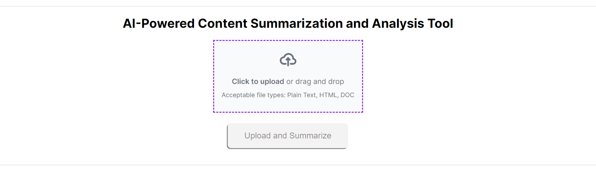
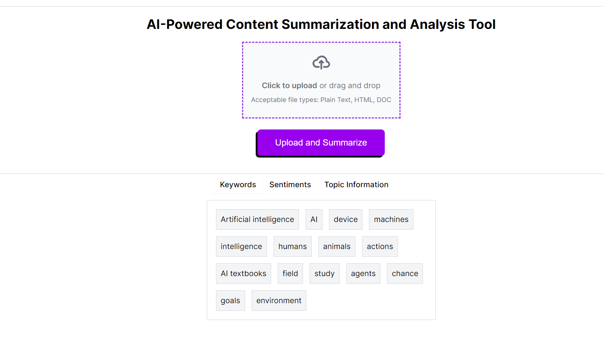

# AI-Powered Content Summarization and Analysis Tool
This application allows users to upload text content (articles, documents, emails, etc.) and receive a summarized version with key insights and analysis. The application leverages AI services to analyze the text, providing sentiment analysis, entity analysis, and topic classification.

# Features
File Upload: Supports uploading plain text, HTML, and DOCX files.
AI Analysis: Integrates with AI services to perform text analysis and summarization.
Sentiment Analysis: Displays the sentiment score and magnitude.
Topic Information: Shows topic classification and confidence.
Keywords Extraction: Lists the keywords extracted from the text.

# Technologies Used
Frontend: Next.js, React.js, Tailwind CSS
Backend: Node.js, Express.js
AI Service: Google Cloud Natural Language API
UI Components: Ant Design, Shadcn

# Getting Started
Prerequisites
Node.js and npm installed on your machine.
Google Cloud account with Natural Language API enabled.

# Running the Application

Start the frontend application:
npm run dev
Open your browser and navigate to http://localhost:3000.

# Usage
On the homepage, click the upload area or drag and drop a file to upload

Select a plain text, HTML, or DOCX file.

Click the "Upload and Summarize" button to start the analysis.

Once the analysis is complete, view the results in the respective tabs:

Keywords: Displays the extracted keywords.
Sentiments: Shows the sentiment score and magnitude.
Topic Information: Provides topic classification and confidence levels.
Uploading Files

# Supported Formats
The application supports uploading the following file formats:

Plain Text: .txt files
HTML: .html files
DOCX: .docx files
Steps to Upload
Click the upload area or drag and drop a file.
Select a file from your device.
Click the "Upload and Summarize" button to start the analysis.

# Folder Structure
src/components: Contains reusable UI components like Tabs and Button.
src/pages: Contains the main page components like HomePage.
src/styles: Contains global styles and component-specific styles.
UI Components
The application uses Shadcn for some of its UI components. Shadcn is a set of customizable and accessible React components built with Tailwind CSS.

Shadcn Components Used
Tabs: For displaying different analysis results in tabbed sections.
Button: For handling file upload and analysis actions.
e
